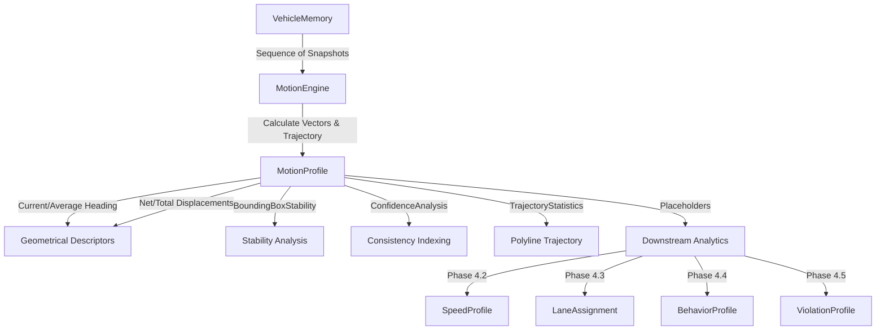

# Motion Analytics Foundation (Phase 4.1)

This document describes the design, pipeline orchestration, mathematical algorithms, and state lifecycles of the Velox Vision Motion Analytics engine.

---

## 1. Architecture Diagram

The motion analytics module is structured as a decoupled foundation layer beneath future perception analytics. It directly reads track coordinate histories from `VehicleMemory` and exports a structured `MotionProfile` onto the `TrackedVehicle` domain entity:

---

## 2. Motion Pipeline

The pipeline updates motion analytics incrementally on every matched track frame:
1. **Track Matching**: Inside the tracker loop, incoming detection boxes are matched with active trajectories.
2. **Memory Update**: Coordinates, area, aspect ratios, and detection confidence are pushed into `VehicleMemory.snapshots`.
3. **Engine Evaluation**:
   - The engine reads the snapshot list.
   - If snapshots length is less than `minimum_snapshots` (default: `5`), profiling is deferred (returns `None`).
   - Otherwise, the engine computes frame-to-frame displacement vectors, cumulative heading statistics, and box dimension variances.
4. **Profile Binding**: The calculated `MotionProfile` object is attached directly to the `TrackedVehicle` instance.
5. **Downstream Consumption**: Subsequent modules (such as visualization rendering HUDs, behavior analyzers, or speed estimation systems) retrieve statistics directly from `vehicle.motion_profile` in $O(1)$ time, preventing redundant path recomputations.

---

## 3. Trajectory Mathematics

### 3.1 Turn Angles & Curvature
For a list of sequential heading directions $\theta_0, \theta_1, \dots, \theta_{N-1}$ in radians:
$$\Delta\theta_i = \text{atan2}(\sin(\theta_{i+1} - \theta_i), \cos(\theta_{i+1} - \theta_i))$$
- **Curvature ($\kappa$)**:
$$\kappa = \frac{\sum_{i} |\Delta\theta_i|}{\text{Total Travelled Distance}}$$
- **Trajectory Smoothness ($S$)**: Measures path consistency. A straight path yields a smoothness of $1.0$:
$$S = 1.0 - \frac{\text{Mean}(|\Delta\theta|)}{\pi}$$

### 3.2 Path Efficiency ($E$)
Evaluates the straight-line displacement ratio:
$$E = \frac{\text{Net Displacement}}{\text{Total Travelled Distance}} = \frac{d(\text{first\_center}, \text{current\_center})}{\sum \text{frame\_displacements}}$$

---

## 4. Motion Lifecycle

Vehicles transition between states based on spatial displacement history:

- **STATIONARY**: The latest displacement is below `stationary_threshold` (default: 2.5 pixels).
- **SLOW_MOVEMENT**: The vehicle is moving, but the recent displacement is less than $2 \times \text{stationary\_threshold}$.
- **MOVING**: The vehicle displacement exceeds the slow threshold.
- **CONTINUOUS_MOVEMENT**: The vehicle has been continuously moving (displacement $\ge$ threshold) for 10 or more consecutive frames.
- **INTERMITTENT_MOVEMENT**: The path contains frequent direction changes (more than 3 coordinate sign shifts).
- **RECOVERED_MOTION**: The tracker lost this vehicle temporarily but re-associated it successfully.

---

## 5. Future Extension Guide

### 5.1 Implementing Speed Estimation (Phase 4.2)
To build speed estimation:
1. Create `SpeedEngine` inheriting from a speed estimator interface.
2. Consume `motion_profile.total_travelled_distance` and frame rate to compute average speeds.
3. Populate the `speed_profile` placeholder on `MotionProfile`.

### 5.2 Implementing Lane Assignment (Phase 4.3)
To track lane positioning:
1. Read `motion_profile.current_center` and check its relative coordinates against mapped lane polylines.
2. Populated the `lane_assignment` placeholder with lane ID and cross-boundary status.
