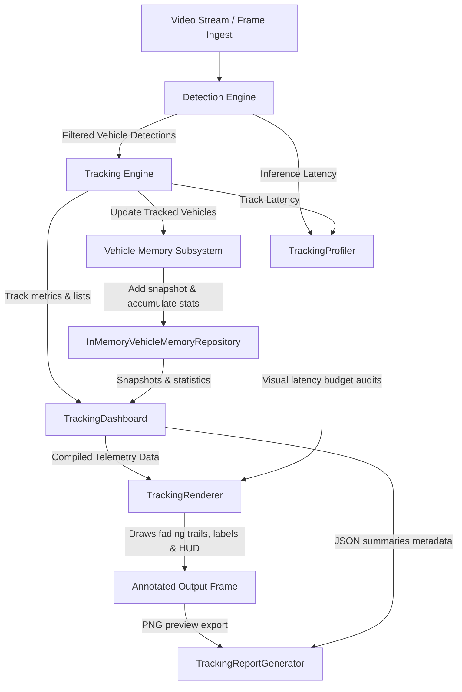

# Tracking Intelligence & Visualization (Phase 3.4)

This document provides a technical guide, rendering pipeline walkthrough, overlay layouts description, and debugging/extensibility guide for the Velox Vision Tracking Visualization layer.

---

## 1. Architecture Diagram

The visualization layer acts as the primary presentation layer for the tracking and vehicle memory subsystems. It aggregates metrics across the entire application runtime:

---

## 2. Rendering Pipeline

The frame annotation loop executes inside [run_detection.py](file:///c:/Users/deeks/Downloads/Velox-Vision/scripts/run_detection.py) following these strict sequential stages:

1. **Latencies Initialization**: The `TrackingProfiler` records the start timestamps of detection and tracking segments.
2. **Detections & Tracking Matching**: The frame is parsed by YOLO and matched by ByteTrack, updating persistent snapshots inside `VehicleMemory`.
3. **Debug Transitions Auditing**: The runner compares the previous state of each track with its current state. If a change occurs (e.g. `Tentative` -> `Confirmed` -> `Tracked`), it logs a transition event.
4. **Telemetry Compilations**: The `TrackingDashboard` computes current stats (Overall FPS, Detection FPS, Tracking FPS, active/lost counts, average confidence, RAM footprint KB).
5. **Renderer Dispatching**:
   - **Movement Trails Drawing**: Connected fading neon lines are drawn under the bounding boxes using the historical snapshot centers.
   - **Label Cards Overlays**: Rounded bounding boxes are drawn in colors matching the current `TrackState`. Detailed label cards are drawn at the top boundary.
   - **Telemetry Banner HUD Drawing**: A transparent overlay banner is drawn at the top displaying system environment speeds and progress ratios.
   - **Debugger & Inspector Sidebars Drawing**: Latency graphs are overlayed, and if a vehicle box is clicked, a detailed memory inspector sidebar opens on the right displaying all stats.
6. **Snapshot & Report Saving**: At the final frame, the generator saves a summary report JSON file and visual PNG preview.

---

## 3. Overlay Layouts

### 3.1 Telemetry HUD Banner (Top Panel)
- **Column 1 (System Speed)**: Displays overall Pipeline FPS, GPU/CPU Detection FPS, and Tracking FPS.
- **Column 2 (Track counts)**: Lists Active Tracks, Lost Tracks, and Recovered Tracks.
- **Column 3 (History)**: Shows Total Created Tracks and Longest Lifetime (frames).
- **Column 4 (Quality index)**: Displays Average Confidence (%) and Memory Footprint (KB).
- **Timeline progress bar**: A thin visual bar at the base of the banner, changing color dynamically from orange to green as progress increases.

### 3.2 Vehicle Bounding Box Card
- Rounded corners drawn in state-themed BGR colors.
- Detail card contains:
  - **Line 1**: Class and ID (e.g., `CAR #14`)
  - **Line 2**: Track state and current confidence (e.g., `Tracked 96%`)
  - **Line 3**: Track age and observation count (e.g., `Age: 62 Obs: 61`)

### 3.3 Memory Inspector Sidebar (Right Panel)
- Activated on mouse click callbacks inside the bounding boxes.
- Displays:
  - Identity & active state.
  - Snapshot count, observation count, track age.
  - Confidence statistics (average, highest, lowest, stability indices).
  - Movement descriptors (total displacement, net displacement, path efficiency).
  - Detail attributes of the latest snapshot.
  - Phase 4 downstream placeholders (OCR text, speed estimation).

---

## 4. Telemetry Explanations

| Telemetry Key | Source Metric | Description |
| :--- | :--- | :--- |
| **Pipeline FPS** | Frame loop duration timer | Speed of the entire processing stream. |
| **Detection FPS** | YOLO inference latency | Speed of the detector stage alone. |
| **Tracking FPS** | ByteTrack matching latency | Speed of the tracking association logic. |
| **Memory Footprint** | `sys.getsizeof` on active records | Estimated memory usage of the vehicle repository. |
| **Path Efficiency** | Net / Total displacement | Straight-line distance / total path length. Close to 1.0 represents straight movements. |
| **Confidence Stability** | `1.0 - standard_deviation` | Stability of YOLO confidence. Closer to 1.0 represents stable confidence. |

---

## 5. Debug Guide

- **Toggle Debug Mode**: Set `tracking_visualization.debug: true` in `config/default.yaml` to display real-time latency profiles and recent track state transitions on the screen.
- **Check Budget Violations**: Open console logs to check warning audits like:
  `[LATENCY BUDGET VIOLATION] Visualization took 2.27ms (Budget: 1.00ms)`.
- **Interactive Inspection**: Run the pipeline preview window (`runner.show_preview: true`). Click on any vehicle box to display its sidebar inspector, and click again to close.

---

## 6. Future Extension Guide

The visualization subsystem is designed to be independent of future AI analytics. To extend:
- **Speed Estimation**: Hook the output into `vehicle.memory.estimated_speed_kmh` and the Inspector panel will automatically display it.
- **OCR/ANPR**: Write OCR results into `vehicle.memory.license_plate_text` and the inspector will show it without changing drawing logic.
- **Risk Assessment**: Map risk values into `vehicle.memory.risk_score` for automatic display.
