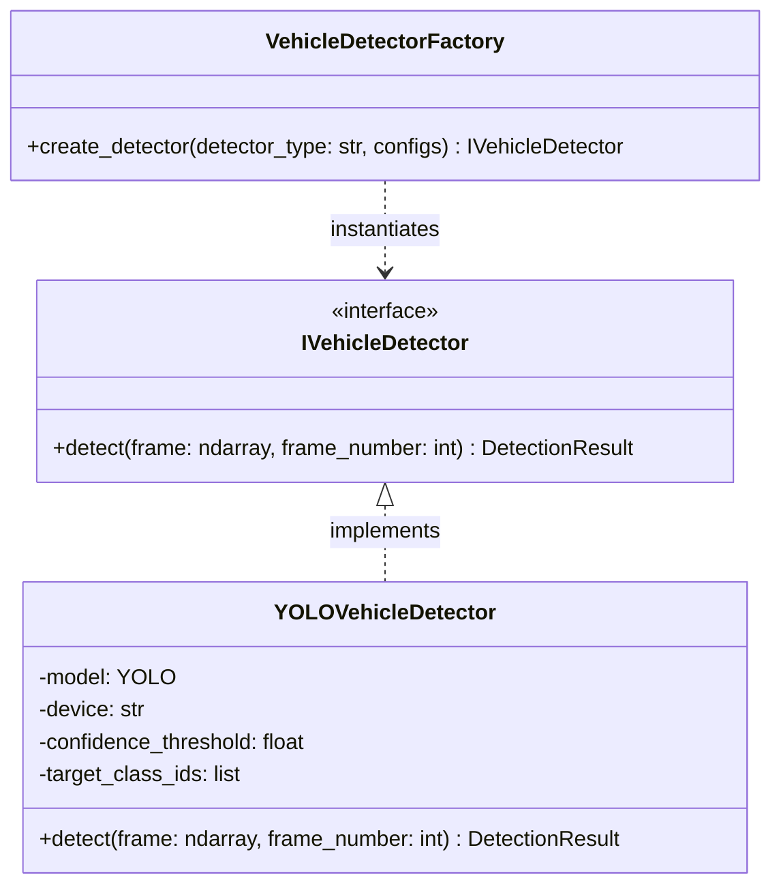
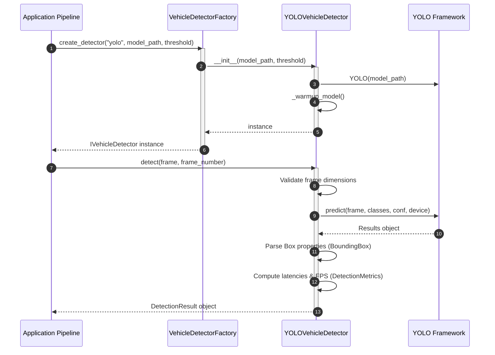

# Vehicle Detection Engine

The **Vehicle Detection Engine** is responsible for identifying target vehicles (cars, motorcycles, buses, trucks) in real-time video frames. It captures coordinate, confidence, and type metadata, and outputs performance telemetry.

---

## Architecture
The engine adheres strictly to **Clean Architecture** and **Dependency Inversion** principles:
- **Core Abstractions**: Core entities (`BoundingBox`, `VehicleDetection`, `DetectionResult`, `DetectionMetrics`) and contract interfaces (`IVehicleDetector`) are declared independently.
- **YOLO Framework wrapping**: The concrete `YOLOVehicleDetector` implements the contract and wraps the YOLO neural network.
- **Factory pattern**: The client initializes detectors via `VehicleDetectorFactory`, hiding framework instantiation details.

---

## Execution Flow

The sequence diagram below displays the lifecycle of a frame processing request within the vehicle detection engine:

---

## Data Payloads (Input / Output)

### Input
- **frame**: `numpy.ndarray` (3-channel BGR OpenCV image array).
- **frame_number**: `int` (incremental frame tracker index).

### Output (`DetectionResult`)
- **detections**: List of `VehicleDetection` objects:
  - `bbox` (`BoundingBox`):
    - `x1`, `y1`, `x2`, `y2`: Absolute bounding coordinates.
    - `width`, `height`, `center_x`, `center_y`, `area`: Computed dynamically.
  - `confidence`: `float` (0.0 to 1.0).
  - `class_name`: `str` (`car`, `motorcycle`, `bus`, `truck`).
  - `class_id`: `int`.
- **metrics** (`DetectionMetrics`):
  - `preprocess_time_ms`, `inference_time_ms`, `postprocess_time_ms`, `total_latency_ms`: Durations in milliseconds.
  - `fps`: Current execution rate.
- **frame_number**: `int` (echoed index).
- **timestamp**: `float` (UNIX epoch process time).
- **model_name**: `str` (YOLO weights identifier used).

---

## Future Improvements
- **Batch Inference**: Extend `detect_batch(self, List[np.ndarray]) -> List[DetectionResult]` to leverage parallel frame parsing.
- **Dynamic Class Tuning**: Support updating target labels at runtime without reloading model weights.
- **Precision Quantization**: Incorporate TensorRT (`.engine`) or OpenVINO (`.xml`/`.bin`) weights for faster inference.
